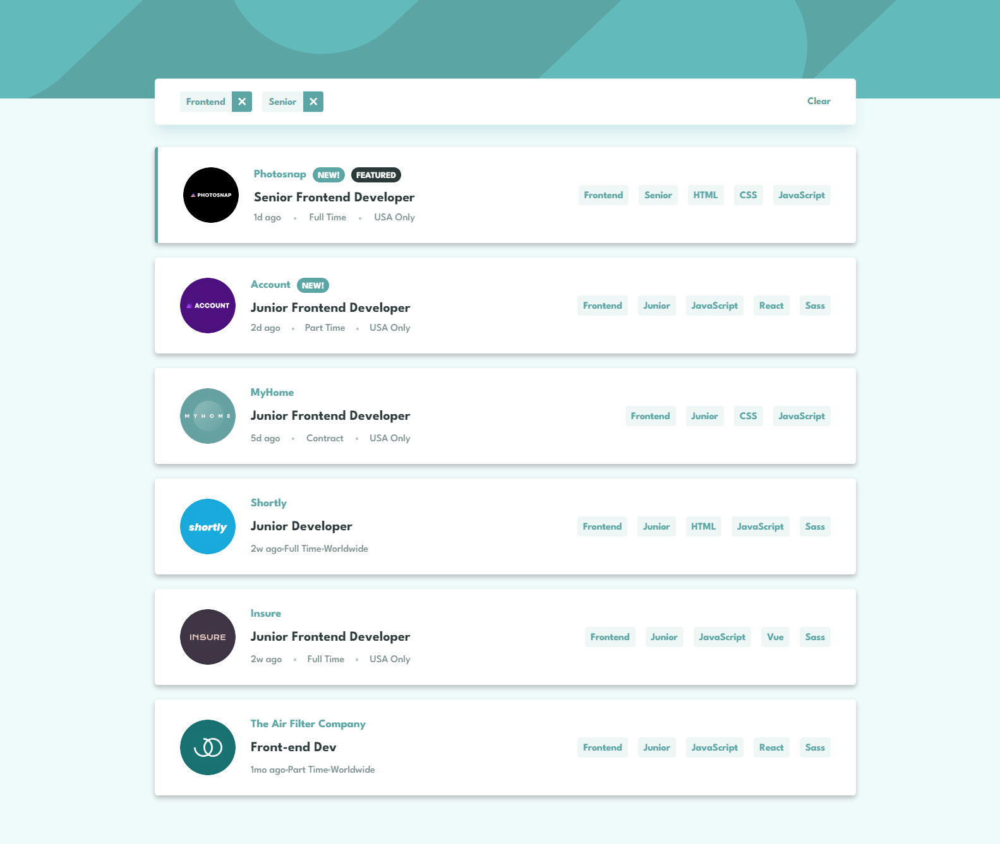
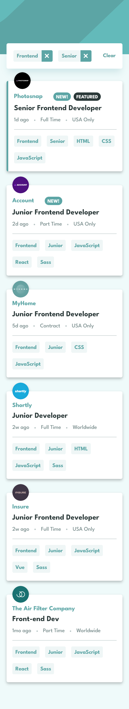

# Frontend Mentor - Job listings with filtering solution

This is a solution to the [Job listings with filtering challenge on Frontend Mentor](https://www.frontendmentor.io/challenges/job-listings-with-filtering-ivstIPCt). Frontend Mentor challenges help you improve your coding skills by building realistic projects. 

### The challenge

Users should be able to:

- View the optimal layout for the site depending on their device's screen size
- See hover states for all interactive elements on the page
- Filter job listings based on the categories

### Screenshot

It is my pleasure to share with you a screenshot of my solution to the job-listings challenge. I have invested considerable time and effort into developing a clean, user-friendly interface that is designed to streamline the job application process. The job listings are displayed in a clear and concise manner, with important details such as job title, company name, and location prominently displayed. I have also implemented filters that allow users to narrow their search based on specific criteria, such as job type or location. Overall, I believe that my solution represents a significant step forward in the world of job listings, and I look forward to hearing your thoughts and feedback.

### Links

- Live Site URL: [job-listings](https://job-listings-mu.vercel.app/)

### Built with

- Semantic HTML5 markup
- CSS custom properties
- SASS/SCSS
- Typescript
- [React](https://reactjs.org/) - JS library

## Author

- Website - [Jownsu](https://jownsu.github.io/)
- Frontend Mentor - [@jownsu](https://www.frontendmentor.io/profile/jownsu)
- Instagram - [jownsu](https://www.instagram.com/jownsu/)
- Linked In - [Jhones](https://www.linkedin.com/in/jhones-digno-866904213/)
